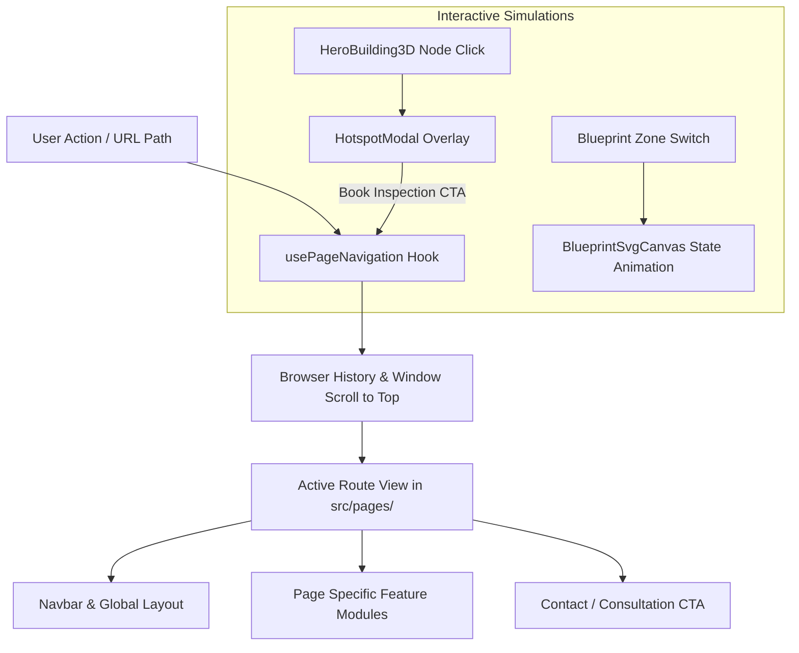

# Cosmic Fire Engineering — Project Context & Documentation

## 1. Project Overview

**Cosmic Fire** is an interactive, high-performance web platform showcasing industrial-grade fire protection, suppression, detection, and lifecycle safety engineering services across London and Kent.

The application combines architectural engineering aesthetics with interactive 3D simulations (Three.js), a modular SVG schematic blueprint simulator, technical telemetry hotspot inspection, and multi-channel client inquiries for commercial, residential, education, healthcare, industrial, and retail premises.

### Key Highlights:

- **Interactive 3D Building Simulation**: Real-time Three.js isometric building model with interactive sensor nodes, alarm states, and floor isolation mechanics.
- **Interactive Blueprint Simulator**: Schematic canvas with live simulated alarm scenarios across multiple facility zones (Server Room, Logistics Warehouse, Atrium), separated cleanly into dedicated SVG graphics and typed data models.
- **Dedicated Solution & Sector Directories**: 14 specialized fire safety services (Suppression, Alarms, Fire Doors, Fire Risk Assessments, Extinguishers, Hydrants, etc.) and 6 industry sectors.
- **Modular Data & Type Architecture**: Zero hardcoded strings across components; structured data models organized by domain (`about`, `services`, `industries`, `testimonials`, `blueprint`, `company`, `footer`, `faq`, `layers`, `whyUs`, `hero`, `technology`).
- **Shared Navigation Hook**: Unified `usePageNavigation` hook handling URL routing, scroll restoration, and hash synchronizations without duplicated logic across pages.
- **Full-Bleed Responsive Layouts**: 100% full-screen width architecture across Navbar, Hero, Content Sections, and Footer with tailored horizontal padding (`px-3 sm:px-4 md:px-6` / `px-4 sm:px-8 md:px-12 lg:px-16 xl:px-20`).
- **Adaptive Mobile Breakpoints**: Responsive navigation converting to touch drawer overlay precisely at 1136px and below (`min-[1137px]:hidden` / `min-[1137px]:flex`).
- **Consistent Zero-Shift Header**: Fixed-height navbar (`h-16 sm:h-20 md:h-22`) providing uniform vertical balance before and after scrolling with enlarged brand logo.
- **Premium Design System**: Bone/ivory surfaces (`#F8F5ED`), deep charcoal typography (`#171B18`), high-visibility safety orange accents (`#FF4D0A`), rotating 3px shiny borders on cards, and responsive layouts across all device form factors.

---

## 2. Technology Stack

- **Framework**: React 19 (`react`, `react-dom`)
- **Language**: TypeScript 5+ (`tsc`)
- **Bundler & Build Tool**: Vite 8 with `@vitejs/plugin-react` and `@generouted/react-router`
- **Styling**: Tailwind CSS v4 (`tailwindcss`, `@tailwindcss/vite`) with custom CSS animations
- **3D Graphics**: Three.js (`three`, `@types/three`)
- **Animation & Motion**: Motion / Framer Motion (`motion`)
- **Icons**: Lucide React (`lucide-react`)
- **Package Manager**: PNPM

---

## 3. Folder & File Structure

```text
cosmic-fire/
├── .gitignore                   # Git ignore specifications
├── context.md                   # Complete architectural and project documentation
├── index.html                   # HTML entry point (loads Sora, Manrope, JetBrains Mono fonts)
├── package.json                 # Scripts and dependency declarations
├── pnpm-lock.yaml               # Deterministic dependency lockfile
├── pnpm-workspace.yaml          # PNPM workspace configuration
├── tsconfig.json                # Strict TypeScript configuration
├── vite.config.ts               # Vite configuration (plugins, aliases, bundle code-splitting)
├── public/                      # Static assets (logo.png, favicons)
└── src/
    ├── main.tsx                 # Application entry point & React DOM root mount
    ├── App.tsx                  # Master layout controller & global overlay provider
    ├── index.css                # Global CSS rules, custom keyframes, technical background grids
    │
    ├── types/                   # Domain-driven TypeScript type definitions
    │   ├── index.ts             # Central type export hub
    │   ├── about.ts             # Pillars, credentials, statistics types
    │   ├── article.ts           # Technical whitepaper & resource types
    │   ├── blueprint.ts         # Zone & blueprint simulation types
    │   ├── company.ts           # Company contact & office info types
    │   ├── contact.ts           # Consultation form and quote types
    │   ├── faq.ts               # FAQ items and category types
    │   ├── footer.ts            # Footer links, compliance badges, columns
    │   ├── hotspot.ts           # 3D sensor hotspot & telemetry types
    │   ├── industry.ts          # Sector profiles & network coverage types
    │   ├── navigation.ts        # Page IDs and route types
    │   ├── service.ts           # Service items, disciplines, and feature types
    │   ├── technology.ts        # Lifecycle steps and pipeline types
    │   └── testimonial.ts       # Client review and testimonial types
    │
    ├── data/                    # Domain-driven central data repositories
    │   ├── about.ts             # About section pillars, milestones, and credentials
    │   ├── blueprint.ts         # Schematic zones, sensors, and telemetry scenarios
    │   ├── company.ts           # Shared office addresses, phone numbers, and emails
    │   ├── constants.ts         # Global fallback constants & legacy mappings
    │   ├── faq.ts               # Frequently asked questions list
    │   ├── footer.ts            # Site links, legal notices, and compliance credentials
    │   ├── hero.ts              # Hero banner copy, highlights, and solution ticker
    │   ├── industries.ts        # Multi-site coverage copy and 6 sector cards
    │   ├── layers.ts            # One System. Multiple Layers (Active & Passive protection items)
    │   ├── services.ts          # 14 core fire protection services with detailed specs
    │   ├── technology.ts        # Detect. Alert. Respond. 4-stage engineering lifecycle data
    │   ├── testimonials.ts      # Verbatim client reviews and ratings
    │   └── whyUs.ts             # Why Choose Cosmic Fire & 6 premises protection pillars
    │
    ├── hooks/
    │   └── usePageNavigation.ts # Centralized page navigation, URL updates, and window scrolling
    │
    ├── pages/                   # File-based route views (generouted)
    │   ├── index.tsx            # Home landing page
    │   ├── about/               # About page
    │   ├── faq/                 # FAQ page
    │   ├── industries/          # Industries page
    │   ├── protection/          # Multi-Layer Protection (Active & Passive) page
    │   ├── solutions/           # Solutions & services page
    │   ├── technology/          # Technology & lifecycle pipeline page
    │   └── [...all].tsx         # 404 / Catch-all fallback route
    │
    ├── validations/
    │   └── contact.ts           # Contact form schema and validation rules
    │
    └── components/              # Modular UI and interactive components
        ├── AboutSection.tsx     # 4 Core pillars, credentials, and company story
        ├── CinematicBanner.tsx  # Mission statement & emergency readiness CTA
        ├── ConsultationForm.tsx # Interactive lead capture and consultation booking form
        ├── ContactOfficeInfo.tsx# Reusable office locations, phone, and email info cards
        ├── ContactSection.tsx   # Combined consultation form and office details section
        ├── Footer.tsx           # Multi-column footer with brand logo and compliance badges
        ├── HeroBuilding3D.tsx   # Three.js 3D isometric tower with interactive sensor nodes
        ├── HeroSection.tsx      # Main landing banner hosting the 3D visualizer
        ├── HotspotModal.tsx     # Sensor inspection modal with real-time specs & NFPA telemetry
        ├── IndustriesSection.tsx# Multi-site coverage & 6 sector cards with rotating borders
        ├── InteractiveBlueprint.tsx # Interactive 2D schematic floorplan with alarm simulator
        ├── Navbar.tsx           # Sticky top navigation with brand logo, links, and booking CTA
        ├── ProtectionLayers.tsx # Multi-tier active & passive protection layers component
        ├── ServicesShowcase.tsx # Horizontal category pills & 14 fire protection service cards
        ├── TechnologyFlow.tsx   # 3-Stage pipeline: DETECT → ALERT → RESPOND
        ├── TestimonialsSection.tsx # Rotating shiny border testimonial cards with client quotes
        ├── WhyCosmicFire.tsx    # Safety metrics & engineering breakdown
        ├── common/              # Reusable atoms and small layout wrappers
        └── graphics/            # SVG graphic canvases (e.g. BlueprintSvgCanvas)
```

---

## 4. Key Components & Features

| Component              | Path                                                                                                                                            | Description                                                                                                                |
| ---------------------- | ----------------------------------------------------------------------------------------------------------------------------------------------- | -------------------------------------------------------------------------------------------------------------------------- |
| `Navbar`               | [src/components/Navbar.tsx](file:///home/mazahir/projects/work/cosmic-fire/src/components/Navbar.tsx)                                           | 100% width header with zero height shift (`h-16 sm:h-20 md:h-22`), 1136px mobile breakpoint, enlarged logo, and CTA.       |
| `HeroSection`          | [src/components/HeroSection.tsx](file:///home/mazahir/projects/work/cosmic-fire/src/components/HeroSection.tsx)                                 | 100% full screen width banner hosting the 3D visualizer, responsive typography, and action CTAs.                           |
| `HeroBuilding3D`       | [src/components/HeroBuilding3D.tsx](file:///home/mazahir/projects/work/cosmic-fire/src/components/HeroBuilding3D.tsx)                           | Three.js multi-level isometric structure with animated particle grids, floor planes, and clickable sensor hotspots.        |
| `InteractiveBlueprint` | [src/components/InteractiveBlueprint.tsx](file:///home/mazahir/projects/work/cosmic-fire/src/components/InteractiveBlueprint.tsx)               | Mobile-responsive interactive blueprint with zone selection, gas/water activation simulations, and modular SVG canvas.     |
| `BlueprintSvgCanvas`   | [src/components/graphics/BlueprintSvgCanvas.tsx](file:///home/mazahir/projects/work/cosmic-fire/src/components/graphics/BlueprintSvgCanvas.tsx) | Dedicated, clean SVG canvas rendering architectural room layout, sensors, sprinkler heads, and active fire alarms.         |
| `WhyCosmicFire`        | [src/components/WhyCosmicFire.tsx](file:///home/mazahir/projects/work/cosmic-fire/src/components/WhyCosmicFire.tsx)                             | Mobile-responsive 6 premises protection pillars, safety metrics, and long-term investment closing statement.               |
| `ProtectionLayers`     | [src/components/ProtectionLayers.tsx](file:///home/mazahir/projects/work/cosmic-fire/src/components/ProtectionLayers.tsx)                       | One System. Multiple Layers of Protection with Active (5 items) and Passive (9 items) fire engineering tabs.               |
| `ServicesShowcase`     | [src/components/ServicesShowcase.tsx](file:///home/mazahir/projects/work/cosmic-fire/src/components/ServicesShowcase.tsx)                       | 14 fire protection service cards filterable via horizontal top pills, with "Get Protected" CTAs and feature bullet points. |
| `IndustriesSection`    | [src/components/IndustriesSection.tsx](file:///home/mazahir/projects/work/cosmic-fire/src/components/IndustriesSection.tsx)                     | Multi-site network coverage overview and 6 sector cards rendered directly in a responsive grid with rotating neon borders. |
| `TechnologyFlow`       | [src/components/TechnologyFlow.tsx](file:///home/mazahir/projects/work/cosmic-fire/src/components/TechnologyFlow.tsx)                           | 4-Stage engineering pipeline: Understand Risk, Detect Early, Alert Clearly, and Respond Safely with technology maps.       |
| `TestimonialsSection`  | [src/components/TestimonialsSection.tsx](file:///home/mazahir/projects/work/cosmic-fire/src/components/TestimonialsSection.tsx)                 | Verbatim client feedback in high-tech cards featuring rotating conic border animations.                                    |
| `AboutSection`         | [src/components/AboutSection.tsx](file:///home/mazahir/projects/work/cosmic-fire/src/components/AboutSection.tsx)                               | 4 core engineering pillars (Vision, Mission, Approach, Support), company story, and accreditation highlights.              |
| `ContactSection`       | [src/components/ContactSection.tsx](file:///home/mazahir/projects/work/cosmic-fire/src/components/ContactSection.tsx)                           | Consultation booking form integrated with shared office contact information.                                               |
| `Footer`               | [src/components/Footer.tsx](file:///home/mazahir/projects/work/cosmic-fire/src/components/Footer.tsx)                                           | 100% full-screen width footer with enlarged logo, core systems checkmarks, live monitoring status, and Words4Web credit.   |

---

## 5. Navigation & State Architecture



---

## 6. Development & Build Commands

| Command        | Description                                                           |
| -------------- | --------------------------------------------------------------------- |
| `pnpm install` | Installs all project dependencies                                     |
| `pnpm dev`     | Starts the local Vite development server on `http://localhost:3000`   |
| `pnpm build`   | Compiles TypeScript and builds optimized production bundle in `dist/` |
| `pnpm preview` | Previews the production build locally                                 |
| `pnpm lint`    | Runs TypeScript compiler type checks (`tsc --noEmit`)                 |
