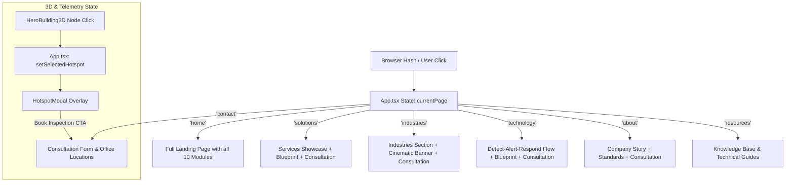

# Cosmic Fire Engineering — Project Context & Documentation

## 1. Project Overview

**Cosmic Fire** is an interactive, high-performance web platform showcasing industrial-grade fire protection, suppression, detection, and lifecycle safety engineering services.

The application combines architectural engineering aesthetics with interactive 3D simulations (Three.js), real-time fire safety blueprint simulators, technical telemetry hotspot inspection, and lead capture for commercial, industrial, and high-risk facilities.

### Key Highlights:

- **Interactive 3D Visualization**: Real-time Three.js isometric building simulation featuring active safety sensor nodes, alarm states, and floor isolation mechanics.
- **Interactive Blueprint Simulator**: Schematic canvas with live simulated alarm scenarios across multiple facility zones (Server Room, Logistics Warehouse, Atrium).
- **Comprehensive Solution Directory**: 8 specialized fire engineering disciplines (Suppression, Sprinklers, Detection, Smoke Control, Hydrants, Foam, Kitchen Hoods, Inspections).
- **Responsive Single-Page & Deep-Link Hash Navigation**: Smooth client-side routing synchronized with the browser history and address bar hash.
- **Premium Design System**: Industrial bone/ivory surfaces (`#F8F5ED`), deep charcoal typography (`#171B18`), and high-visibility safety orange accents (`#FF4D0A`).

---

## 2. Technology Stack

- **Framework**: React 19 (`react`, `react-dom`)
- **Language**: TypeScript 5+ (`tsc`)
- **Bundler & Build Tool**: Vite 8 with `@vitejs/plugin-react`
- **Styling**: Tailwind CSS v4 (`tailwindcss`, `@tailwindcss/vite`) with custom CSS animations
- **3D Graphics**: Three.js (`three`, `@types/three`)
- **Animation & Motion**: Motion / Framer Motion (`motion`)
- **Icons**: Lucide React (`lucide-react`)
- **Package Manager**: PNPM

---

## 3. Folder & File Structure

```text
cosmic-fire/
├── .gitignore                   # Git ignore specifications (dependencies, builds, env, caches)
├── context.md                   # Complete architectural and project documentation
├── index.html                   # HTML entry point (loads Sora, Manrope, JetBrains Mono fonts)
├── package.json                 # Scripts and dependency declarations
├── pnpm-lock.yaml               # Deterministic dependency lockfile
├── pnpm-workspace.yaml          # PNPM configuration & build script permissions
├── tsconfig.json                # Strict TypeScript configuration
├── vite.config.ts               # Vite configuration (plugins, aliases, bundle code-splitting)
└── src/
    ├── main.tsx                 # Application entry point & React DOM root mount
    ├── App.tsx                  # Master layout controller, hash router, and modal manager
    ├── index.css                # Global CSS rules, custom keyframes, technical background grids
    ├── types.ts                 # TypeScript data types (Hotspots, Services, TechSteps, Form data)
    │
    ├── data/
    │   └── mockData.ts          # Central data repository for services, hotspots, specs, and articles
    │
    └── components/              # Modular UI and Interactive feature components
        ├── Navbar.tsx           # Sticky top navigation with page links and quick-booking CTA
        ├── HeroSection.tsx      # Main landing banner hosting the 3D building visualizer
        ├── HeroBuilding3D.tsx   # Three.js interactive 3D tower with live sensor hotspot nodes
        ├── InteractiveBlueprint.tsx # Interactive 2D schematic floorplan with alarm simulator
        ├── HotspotModal.tsx     # Technical inspection modal (telemetry, specs, NFPA compliance)
        ├── ServicesShowcase.tsx # Filterable 8-discipline engineering solutions showcase
        ├── TechnologyFlow.tsx   # Step-by-step pipeline: DETECT → ALERT → RESPOND
        ├── WhyCosmicFire.tsx    # Value metrics & sprinkler engineering breakdown
        ├── IndustriesSection.tsx# Sector-specific safety profiles (Commercial, Logistics, Healthcare, Data Centers)
        ├── CinematicBanner.tsx  # Full-bleed mission statement & emergency readiness CTA
        ├── ResourcesSection.tsx # Technical knowledge base, compliance whitepapers, and guides
        ├── AboutSection.tsx     # Company story, credentials, standards adherence, team
        ├── ContactSection.tsx   # Multi-field engineering consultation booking form
        └── Footer.tsx           # Site map, compliance badges, contact info, legal
```

---

## 4. Key Components & Features

| Component              | Path                                                                                                                              | Description                                                                                                                                            |
| ---------------------- | --------------------------------------------------------------------------------------------------------------------------------- | ------------------------------------------------------------------------------------------------------------------------------------------------------ |
| `App`                  | [src/App.tsx](file:///home/mazahir/projects/work/cosmic-fire/src/App.tsx)                                                         | Manages client hash-based page transitions (`#home`, `#solutions`, `#industries`, `#technology`, `#about`, `#resources`, `#contact`) and modal states. |
| `HeroBuilding3D`       | [src/components/HeroBuilding3D.tsx](file:///home/mazahir/projects/work/cosmic-fire/src/components/HeroBuilding3D.tsx)             | Canvas-rendered 3D multi-level isometric structure with animated particle grids, floor planes, and clickable sensor hotspots.                          |
| `InteractiveBlueprint` | [src/components/InteractiveBlueprint.tsx](file:///home/mazahir/projects/work/cosmic-fire/src/components/InteractiveBlueprint.tsx) | Interactive SVG/canvas floorplan demonstrating water flow, gas discharge, and sensor telemetry across active zones.                                    |
| `HotspotModal`         | [src/components/HotspotModal.tsx](file:///home/mazahir/projects/work/cosmic-fire/src/components/HotspotModal.tsx)                 | Telemetry inspection modal detailing hardware specifications, NFPA/EN standards, and inquiry redirection.                                              |
| `ServicesShowcase`     | [src/components/ServicesShowcase.tsx](file:///home/mazahir/projects/work/cosmic-fire/src/components/ServicesShowcase.tsx)         | Detailed breakdown of fire suppression systems, alarms, sprinklers, and compliance maintenance services.                                               |
| `TechnologyFlow`       | [src/components/TechnologyFlow.tsx](file:///home/mazahir/projects/work/cosmic-fire/src/components/TechnologyFlow.tsx)             | Explains the 3-stage lifecycle safety loop: Detection, Alerting, and Suppression Response.                                                             |
| `ContactSection`       | [src/components/ContactSection.tsx](file:///home/mazahir/projects/work/cosmic-fire/src/components/ContactSection.tsx)             | Interactive consultation booking form capturing facility requirements, safety standards, and project scope.                                            |

---

## 5. Data Flow & Routing Architecture



---

## 6. Development & Build Commands

| Command        | Description                                                         |
| -------------- | ------------------------------------------------------------------- |
| `pnpm install` | Installs all required project dependencies                          |
| `pnpm dev`     | Starts the local Vite development server on `http://localhost:3000` |
| `pnpm build`   | Builds optimized production bundle in `dist/` with chunk splitting  |
| `pnpm preview` | Serves the production build locally for verification                |
| `pnpm lint`    | Runs TypeScript compiler type-check (`tsc --noEmit`)                |
| `pnpm clean`   | Removes build artifacts (`dist/`)                                   |
